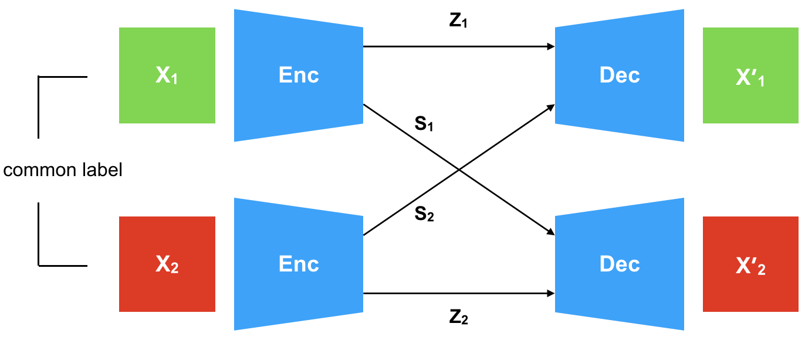
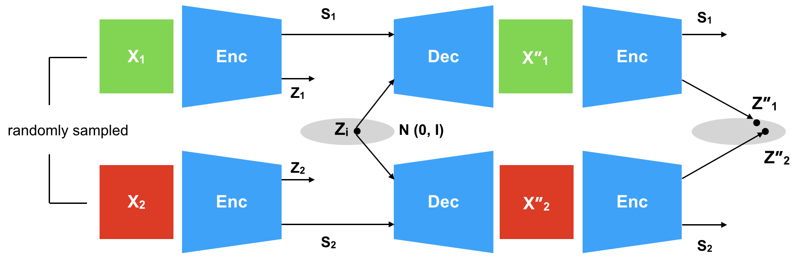
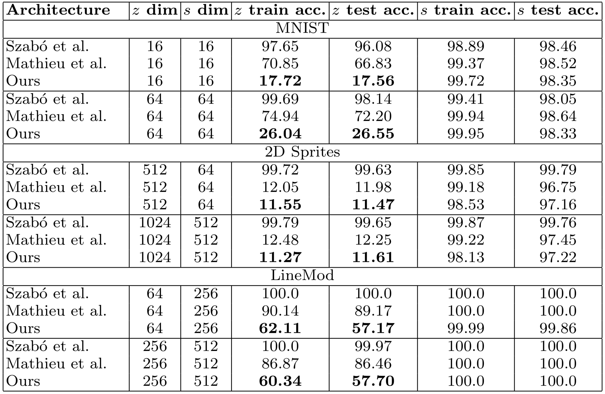
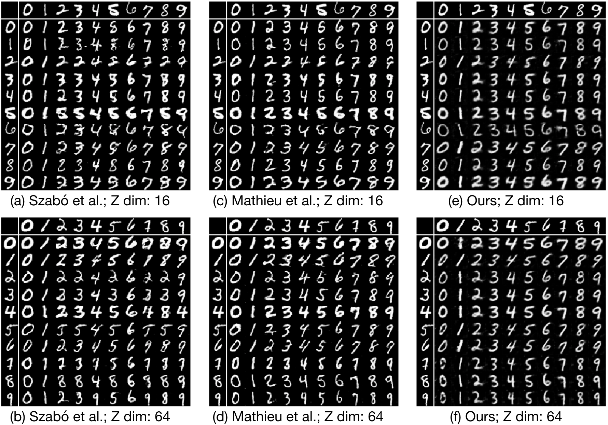
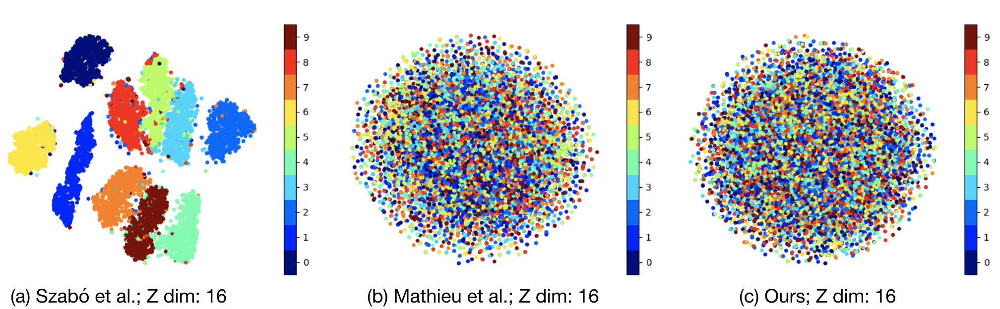

# Disentangling Factors of Variation with Cycle-Consistent Variational Auto-Encoders

This repository contains the code for the paper: Disentangling Factors of Variation with Cycle-Consistent Variational Auto-encoders (https://arxiv.org/abs/1804.10469). The code has been tested with the following python interpreter and library versions:

 - python 3.6.3
 - pytorch 0.4.0
 - torchvision 0.2.1
 - argparse 1.1
 - numpy 1.13.3
 - matplotlib 2.2.2
 - tensorboardX 1.2

The repository provides the files necessary to train our architecture on MNIST dataset, while it can be generalised to other datasets in our paper by changing the **data_loader** and **networks** files.

The other two works used for comparison are:
 - Mathieu et al. (https://arxiv.org/abs/1611.03383)
 - Szabó et al. (https://arxiv.org/abs/1711.02245)
 
Adding a link to a version of the 2D Sprites dataset. This dataset was provided by Scott Reed in his work 'Deep Visual Analogy-Making'. Be sure to cite his work if you use the dataset. 

http://www-personal.umich.edu/~reedscot/files/nips2015-analogy-data.tar.gz

## Abstract

Generative models that learn disentangled representations for different factors of variation in an image can be very useful for targeted data augmentation. By sampling from the disentangled latent subspace of interest, we can efficiently generate new data necessary for a particular task. Learning disentangled representations is a challenging problem, especially when certain factors of variation are difficult to label. In this paper, we introduce a novel architecture that disentangles the latent space into two complementary subspaces by using only weak supervision in form of pairwise similarity labels. Inspired by the recent success of cycle-consistent adversarial architectures, we use cycle-consistency in a variational auto-encoder framework. Our non-adversarial approach is in contrast with the recent works that combine adversarial training with auto-encoders to disentangle representations. We show compelling results of disentangled latent subspaces on three datasets and compare with recent works that leverage adversarial training.

## Contributions

 - We point out the limitations of the recently introduced adversarial architectures for disentangling factors of variation
 - We introduce *cycle-consistent variational auto-encoders*, a weakly supervised generative model, that disentangles specified and unspecified factors of variation using only pairwise similarity labels
 - We empirically show that our proposed architecture avoids *degeneracy* and is robust to the choices of dimensionality of both the specified and unspecified latent subspaces
 - We claim and empirically verify that cycle-consistent VAEs produce highly disentangled latent representations by explicitly training the encoder to reduce leakage of specified factors of variation into the unspecified subspace

## Architecture

### Forward cycle

### Reverse cycle

## Results

#### Empirical comparison of quality of disentangled representations

#### Comparison of image generation capabilities of various architectures

#### t-SNE plots to show leakage of information pertaining to specified factors of variation into the unspecified latent space

